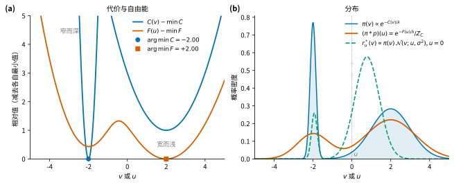

# 高斯卷积、自由能与相对熵

> 问题来源：推导 MPPI 时的一个直觉——“有一个分布，这个分布的高斯卷积，就对应着关于这个分布的、带 KL 正则的分布优化的最优解；正则项是 $D_{\mathrm{KL}}(r\,\|\,p)$，$p$ 是零均值高斯。”
>
> 本章先给结论，再给推导，最后给直观解释。

## 1. 结论

### 1.1 一句话版本

!!! conclusion "结论"
    直觉基本正确，但要把**最优解**和**最优值**分开：

    1. 带 KL 正则的分布优化，其**最优分布**是“代价分布 $\pi$ × 高斯”的**归一化乘积**（一个后验），**不是**卷积。
    2. 高斯卷积出现在**归一化常数**里：卷积密度 $=\exp(-\text{最优值}/\lambda)$，而这个最优值就是**自由能**。
    3. 若 $p=\mathcal N(0,\Sigma)$ 固定、代价 $C(V)$ 也固定，卷积只在一个点 $U=0$ 出现；让代价平移成 $C(U+\epsilon)$（等价于参考高斯的中心移到 $U$），就得到整条函数：

    $$
    \boxed{\;(\pi * p)(U) \;=\; \frac{1}{Z_C}\,e^{-F(U)/\lambda}\;}
    $$

    即：**$\pi$ 做高斯卷积，恰好等于把能量 $C$ 换成自由能 $F$ 后的 Gibbs 分布**，而且归一化常数 $Z_C$ 都不变。

### 1.2 设定

!!! definition "定义 1（记号）"
    - 代价（能量）$C(V)$，下有界；温度 $\lambda>0$。
    - 参考分布 $p(\epsilon)=\mathcal N(\epsilon;0,\Sigma)$，零均值、固定。
    - 代价定义的 Gibbs 分布（假设 $Z_C<\infty$）：

    $$
    \pi(V)=\frac{1}{Z_C}e^{-C(V)/\lambda},\qquad Z_C=\int e^{-C(V)/\lambda}\,dV .
    $$

    - 自由能泛函与自由能（对每个位置 $U$ 各做一次关于分布 $r$ 的优化，$r$ 不要求是高斯）：

    $$
    \boxed{\;\mathcal A_U[r]=\mathbb E_{\epsilon\sim r}\big[C(U+\epsilon)\big]+\lambda\,D_{\mathrm{KL}}(r\,\|\,p),\qquad F(U)=\min_r \mathcal A_U[r]\;}
    $$

    $U=0$ 就是你原来的问题 $\min_r\,\mathbb E_r[C(V)]+\lambda D_{\mathrm{KL}}(r\|p)$。换元 $V=U+\epsilon$ 后，它等价于以 $p_U=\mathcal N(U,\Sigma)$ 为参考、直接优化 $V$ 的分布；两种写法只差坐标。

### 1.3 定理

!!! theorem "定理 1（Gibbs 变分原理：自由能 = 相对熵正则的最优值）"
    对任意满足 $\mathbb E_p[e^{-C(U+\epsilon)/\lambda}]<\infty$ 的 $U$，令 $Z(U)=\mathbb E_{\epsilon\sim p}\big[e^{-C(U+\epsilon)/\lambda}\big]$，则

    $$
    \boxed{\;F(U)=-\lambda\log Z(U),\qquad r_U^*(\epsilon)=\frac{p(\epsilon)\,e^{-C(U+\epsilon)/\lambda}}{Z(U)}\;}
    $$

    并且对任意分布 $r$，与最优值的差距恰好是相对熵：

    $$
    \boxed{\;\mathcal A_U[r]-F(U)=\lambda\,D_{\mathrm{KL}}(r\,\|\,r_U^*)\;\ge 0\;}
    $$

!!! theorem "定理 2（高斯卷积 = 自由能的 Gibbs 分布）"
    在定义 1 下，对所有 $U$：

    $$
    \boxed{\;Z(U)=Z_C\,(\pi * p)(U),\qquad F(U)=-\lambda\log(\pi*p)(U)-\lambda\log Z_C\;}
    $$

    等价地 $(\pi*p)(U)=e^{-F(U)/\lambda}/Z_C$。在绝对坐标 $V=U+\epsilon$ 下，最优分布为

    $$
    \boxed{\;r_U^*(V)=\frac{\pi(V)\,\mathcal N(V;U,\Sigma)}{(\pi*p)(U)}\;}
    $$

    分子是乘积，分母才是卷积。特别地，$\arg\min_U F(U)=\arg\max_U(\pi*p)(U)$：外层找最优中心，就是找卷积后分布的众数（mode）。

    若 $e^{-C/\lambda}$ 不可积（$Z_C=\infty$），$\pi$ 不存在，但仍有 $e^{-F(U)/\lambda}=(e^{-C/\lambda}*p)(U)$。

!!! theorem "推论 3（均值更新 = 沿自由能的梯度走一步 = 沿卷积分布的 score 走一步）"

    $$
    \boxed{\;\mathbb E_{r_U^*}[V]=U-\frac{\Sigma}{\lambda}\nabla F(U)=U+\Sigma\,\nabla\log(\pi*p)(U)\;}
    $$

    令 $U_{k+1}=\mathbb E_{r_{U_k}^*}[V]$，若期望精确计算，则 $F(U_{k+1})\le F(U_k)$。

    用 $K$ 个样本 $V^{(k)}\sim\mathcal N(U,\Sigma)$ 估计时，$\mathbb E_{r_U^*}[V]\approx\sum_k w_k V^{(k)}$，$w_k\propto e^{-C(V^{(k)})/\lambda}$，这正是 MPPI 形式的加权平均（有限样本下单调性不再保证）。

### 1.4 你的直觉哪里准确、哪里要修正

| 你的说法 | 精确版本 |
|---|---|
| “高斯卷积对应最优解” | 卷积对应**最优值**（自由能）：$(\pi*p)(U)\propto e^{-F(U)/\lambda}$ |
| 最优分布 | 归一化**乘积** $\pi(V)\,\mathcal N(V;U,\Sigma)$，是一个后验，比 $\pi$ 和高斯都更窄 |
| $p$ 是固定零均值高斯 | 此时代价若不平移，卷积只出现在一个点：$F=-\lambda\log(\pi*p)(0)-\lambda\log Z_C$ |
| 想要整条卷积 | 保持 $p$ 不变，把代价写成 $C(U+\epsilon)$，每个 $U$ 各解一次优化 |

## 2. 什么是相对熵

!!! definition "定义 2（相对熵 / KL 散度）"

    $$
    \boxed{\;D_{\mathrm{KL}}(r\,\|\,p)=\mathbb E_{r}\!\left[\log\frac{r(V)}{p(V)}\right]\;}
    $$

    若 $r$ 不关于 $p$ 绝对连续，则定义为 $+\infty$。

它的性质：

- **非负**：$D_{\mathrm{KL}}(r\|p)\ge0$，当且仅当 $r=p$ 时取等（Gibbs 不等式，由 Jensen 不等式得到）。
- **不对称**：$D_{\mathrm{KL}}(r\|p)\ne D_{\mathrm{KL}}(p\|r)$，所以它不是距离。
- **“相对”的意思**：它比较两个分布，不是某一个分布自身的熵 $H(r)=-\mathbb E_r[\log r]$。

直观上有两种读法：

- **编码读法**：数据真实地按 $r$ 出现，你却按 $p$ 设计编码，平均每个样本会多付出 $D_{\mathrm{KL}}(r\|p)$ 奈特。
- **大偏差读法（Sanov 定理）**：从 $p$ 独立采 $n$ 个样本，它们的经验分布“碰巧看起来像 $r$”的概率大约是 $e^{-n\,D_{\mathrm{KL}}(r\|p)}$。所以 KL 衡量的是：**在参考 $p$ 下，要让世界看起来像 $r$ 有多么不可能**。把它乘上 $\lambda$ 作为代价，就是“强行改变自然行为”的价格。

零均值高斯参考下，KL 可以直接展开：

!!! formula "公式 1（高斯参考下的 KL）"

    $$
    \boxed{\;D_{\mathrm{KL}}(r\,\|\,\mathcal N(0,\Sigma))=\tfrac12\,\mathbb E_r\!\left[V^\top\Sigma^{-1}V\right]-H(r)+c_\Sigma\;}
    $$

    其中 $c_\Sigma=\tfrac12\log\big((2\pi)^d\det\Sigma\big)$ 与 $r$ 无关。

所以，只要 $r$ 是协方差也为 $\Sigma$ 的高斯 $\mathcal N(U,\Sigma)$，就有 $\lambda D_{\mathrm{KL}}=\tfrac{\lambda}{2}U^\top\Sigma^{-1}U$，恰好是最优控制里的二次控制代价。

## 3. 什么是自由能

统计物理里，温度为 $T$ 的系统，其能量为 $E(x)$，Helmholtz 自由能为

!!! formula "公式 2（物理中的自由能）"

    $$
    \boxed{\;F=\underbrace{\langle E\rangle}_{\text{平均能量}}-T\,\underbrace{S}_{\text{熵}}=-T\log Z,\qquad Z=\int e^{-E(x)/T}\,dx\;}
    $$

    在所有分布中，使 $\langle E\rangle-TS$ 最小的，恰好是 Gibbs 分布 $e^{-E/T}/Z$（取 $k_B=1$）。

它表达一种折中：能量想让分布集中到最低点，熵想让分布铺开，温度决定两者谁占上风。

我们的 $\mathcal A[r]=\mathbb E_r[C]+\lambda D_{\mathrm{KL}}(r\|p)$ 是它的“相对版本”：把熵 $S=H(r)$ 换成 $-D_{\mathrm{KL}}(r\|p)$。当 $p$ 取均匀（Lebesgue）测度时，两者只差一个常数。代入公式 1：

$$
\mathcal A[r]=\mathbb E_r\!\Big[\,C(V)+\tfrac{\lambda}{2}V^\top\Sigma^{-1}V\Big]-\lambda H(r)+\lambda c_\Sigma .
$$

也就是说，**零均值高斯参考下的自由能泛函，就是物理自由能**，其有效能量为“任务代价 + 二次控制代价”，温度为 $\lambda$。$\mathcal A$ 叫**泛函**（输入分布，输出一个数），它的最小值 $F=-\lambda\log Z$ 叫**（平衡）自由能**，$Z$ 叫**配分函数**。

## 4. 自由能与相对熵的关系

两者是 **Legendre（凸共轭）对偶**。

!!! theorem "定理 4（Donsker–Varadhan 变分公式）"
    对有界可测函数 $f$：

    $$
    \boxed{\;\log\mathbb E_p\big[e^{f}\big]=\sup_r\Big\{\mathbb E_r[f]-D_{\mathrm{KL}}(r\,\|\,p)\Big\},\qquad D_{\mathrm{KL}}(r\,\|\,p)=\sup_f\Big\{\mathbb E_r[f]-\log\mathbb E_p\big[e^{f}\big]\Big\}\;}
    $$

    取 $f=-C/\lambda$ 并乘以 $-\lambda$，第一式就是定理 1。

读法：

- **自由能是相对熵的凸共轭**：给定代价，问“付 KL 代价后，最好能把平均代价压到多少”，答案就是自由能 $-\lambda\log\mathbb E_p[e^{-C/\lambda}]$。
- **相对熵是自由能的凸共轭**：给定一个分布，问“有多少种代价能把它区分出来”，答案就是 KL。

注意一个表达式里出现的两个 KL 含义不同：

| 量 | 含义 |
|---|---|
| $D_{\mathrm{KL}}(r\,\|\,p)$ | 目标函数里的**正则项**：偏离参考分布的代价 |
| $D_{\mathrm{KL}}(r\,\|\,r^*)$ | 事后的**最优性差距**：$\mathcal A[r]$ 比最优自由能高多少（除以 $\lambda$） |

此外，自由能还可以看成代价的一种“软最小”，它介于两种极端之间：

!!! formula "公式 3（自由能的两个极限）"
    - **高温** $\lambda\to\infty$（$\Sigma$ 固定）：展开累积量，得到
      $F(U)=\mathbb E_p[C(U+\epsilon)]-\tfrac{1}{2\lambda}\mathrm{Var}_p[C(U+\epsilon)]+O(\lambda^{-2})$，
      即退化为普通的高斯平滑代价。
    - **低温** $\lambda\to0$ 且 $\Sigma=\lambda T$（$T$ 固定）：由 Laplace 方法，
      $F(U)\to\min_V\Big\{C(V)+\tfrac12(V-U)^\top T^{-1}(V-U)\Big\}$，
      即 $C$ 的 Moreau 包络（近端平滑）。
    - **始终成立**：$F(U)\le\mathbb E_p[C(U+\epsilon)]$。取 $r=p$ 即得；它也就是 Jensen 不等式。

## 5. 推导

### 5.1 定理 1

对任意 $r\ll p$，直接展开 $D_{\mathrm{KL}}(r\|r_U^*)$，其中 $\log r_U^*=\log p-C(U+\epsilon)/\lambda-\log Z(U)$：

$$
\begin{aligned}
D_{\mathrm{KL}}(r\,\|\,r_U^*)
&=\mathbb E_r\big[\log r-\log p\big]+\tfrac1\lambda\,\mathbb E_r\big[C(U+\epsilon)\big]+\log Z(U)\\
&=\tfrac1\lambda\Big(\mathbb E_r[C(U+\epsilon)]+\lambda D_{\mathrm{KL}}(r\,\|\,p)\Big)+\log Z(U).
\end{aligned}
$$

两边乘 $\lambda$，得到 $\mathcal A_U[r]=\lambda D_{\mathrm{KL}}(r\|r_U^*)-\lambda\log Z(U)$。右边第一项非负，当且仅当 $r=r_U^*$ 时为零。因此 $F(U)=-\lambda\log Z(U)$，最优分布为 $r_U^*$。$\square$

### 5.2 定理 2

利用 $e^{-C(V)/\lambda}=Z_C\,\pi(V)$、换元 $V=U+\epsilon$，以及高斯的对称性 $p(V-U)=p(U-V)$：

$$
Z(U)=\int p(\epsilon)\,e^{-C(U+\epsilon)/\lambda}\,d\epsilon
=Z_C\int \pi(V)\,p(U-V)\,dV
=Z_C\,(\pi*p)(U).
$$

代入定理 1，即得 $F(U)=-\lambda\log(\pi*p)(U)-\lambda\log Z_C$。再把 $r_U^*$ 写到 $V$ 坐标下：$r_U^*(V)\propto p(V-U)\,\pi(V)=\pi(V)\,\mathcal N(V;U,\Sigma)$，分母是 $(\pi*p)(U)$。

最后，对两边关于 $U$ 积分，由 $\int(\pi*p)=1$ 得 $\int e^{-F(U)/\lambda}dU=Z_C$。所以 $e^{-F/\lambda}$ 和 $e^{-C/\lambda}$ 的归一化常数相同。$\square$

### 5.3 推论 3

在 $V$ 坐标下，$Z(U)=\int \mathcal N(V;U,\Sigma)\,e^{-C(V)/\lambda}\,dV$。由 $\nabla_U\mathcal N(V;U,\Sigma)=\mathcal N(V;U,\Sigma)\,\Sigma^{-1}(V-U)$：

$$
\nabla_U\log Z(U)=\Sigma^{-1}\big(\mathbb E_{r_U^*}[V]-U\big)
\;\Longrightarrow\;
\nabla F(U)=\lambda\,\Sigma^{-1}\big(U-\mathbb E_{r_U^*}[V]\big).
$$

移项即得 $\mathbb E_{r_U^*}[V]=U-\tfrac{\Sigma}{\lambda}\nabla F(U)$；再用定理 2 的 $\nabla F=-\lambda\nabla\log(\pi*p)$，得到 score 形式。

**单调性**（交替最小化）。记联合目标 $\mathcal L(r,U)=\mathbb E_r[C(V)]+\lambda D_{\mathrm{KL}}(r\,\|\,\mathcal N(U,\Sigma))$，则 $F(U)=\min_r\mathcal L(r,U)$。

- 固定 $U_k$，对 $r$ 最小化，得到 $r_k=r_{U_k}^*$。
- 固定 $r_k$，对 $U$ 最小化：代价项不含 $U$，只剩 $D_{\mathrm{KL}}(r_k\|\mathcal N(U,\Sigma))$，其最小点为 $U_{k+1}=\mathbb E_{r_k}[V]$。

于是

$$
F(U_{k+1})\le\mathcal L(r_k,U_{k+1})\le\mathcal L(r_k,U_k)=F(U_k).\qquad\square
$$

### 5.4 一个可以手算的例子

取 $C(V)=\dfrac{\lambda V^2}{2s^2}$（即 $\pi=\mathcal N(0,s^2)$），$p=\mathcal N(0,\sigma^2)$，一维情形：

!!! formula "公式 4（高斯 × 高斯）"

    $$
    \boxed{\;
    \begin{aligned}
    (\pi*p)(U)&=\mathcal N(U;0,\,s^2+\sigma^2) &&\text{卷积：变宽}\\
    r_U^*(V)&=\mathcal N\!\Big(V;\ \tfrac{s^2}{s^2+\sigma^2}U,\ \tfrac{s^2\sigma^2}{s^2+\sigma^2}\Big) &&\text{最优分布：变窄}\\
    F(U)&=\frac{\lambda\,U^2}{2(s^2+\sigma^2)}+\text{const} &&\text{自由能：曲率从 }\tfrac{\lambda}{s^2}\text{ 降到 }\tfrac{\lambda}{s^2+\sigma^2}
    \end{aligned}\;}
    $$

检验推论 3：$U-\tfrac{\sigma^2}{\lambda}F'(U)=U-\tfrac{\sigma^2U}{s^2+\sigma^2}=\tfrac{s^2}{s^2+\sigma^2}U$，正好等于 $r_U^*$ 的均值。

## 6. 直观解释

### 6.1 三个对象各自在回答什么

| 对象 | 它回答的问题 |
|---|---|
| 最优分布 $r_U^*\propto\pi\cdot\mathcal N(U,\Sigma)$ | 站在 $U$，在高斯探索范围内，**既容易采到、又代价低**的点有哪些？ |
| 卷积 $(\pi*p)(U)$ | 把探索高斯放在 $U$，能**罩住多少**低代价的概率质量？ |
| 自由能 $F(U)=-\lambda\log Z(U)$ | 允许付 KL 代价重新分配概率，这个位置**最好能做到多好**？ |

### 6.2 深而窄 vs 浅而宽

设 $U$ 附近有一块低代价区域，它在 $\mathcal N(U,\Sigma)$ 下的概率质量是 $a$，区域内代价约为 $c$，其他区域的贡献可以忽略。那么 $Z(U)\approx a\,e^{-c/\lambda}$，于是

$$
\boxed{\;F(U)\approx c-\lambda\log a\;}
$$

即**代价低**（$c$ 小）有利，**区域宽、容易被罩住**（$a$ 大）也有利；两者由温度 $\lambda$ 换算成同一个单位。一个极深但极窄的坑，可能输给一个稍浅但很宽的谷。这正是 Entropy-SGD 用 local entropy 偏向“宽谷”的动机。

*图：一维双势阱，$\lambda=1$，$p=\mathcal N(0,0.8^2)$。左侧阱深而窄（宽度 0.15），右侧阱浅而宽（宽度 1.0，底部高 1）。
（a）$C$ 的最小点在窄阱 $v=-2$，但 $F$ 的最小点移到了宽阱 $u=+2$：宽阱被高斯罩住的质量 $a$ 大得多，$-\lambda\log a$ 的收益超过了它多出的深度 $c$（见上式）。两条曲线都减去了各自的最小值。
（b）卷积 $(\pi*p)(u)$ 与 $e^{-F(u)/\lambda}/Z_C$ 数值上一致（误差约 $10^{-13}$）。它把窄阱的尖峰抹平，宽阱成为主峰。绿色虚线是 $u=0$ 处的最优分布 $r_0^*\propto\pi(v)\,\mathcal N(v;0,\sigma^2)$，是逐点乘积，所以同时保留了 $-2$ 处的一个小尖峰和 $0.8$ 附近的主峰，与卷积形状完全不同。
生成脚本：`tools/render_gibbs_convolution.py`。*

### 6.3 乘积 vs 卷积

- **卷积** $\pi*p$：两个独立随机量**相加**（$U=V+\epsilon$）的分布，所以会**变宽**。
- **乘积** $\pi\cdot\mathcal N(U,\Sigma)$：要求一个点**同时**被两个分布支持，所以归一化后**变窄**（见公式 4）。

两者通过“乘积的积分 = 卷积在 $U$ 处的值”联系起来，但不是同一个分布。

### 6.4 贝叶斯读法：后验、证据与 ELBO

把 $\pi$ 当作先验，$V\sim\pi$，观测为 $U=V+\epsilon$，$\epsilon\sim\mathcal N(0,\Sigma)$。那么：

- $(\pi*p)(U)$ 是观测 $U$ 的**边际似然（证据）**；
- $r_U^*(V)$ 是**后验** $p(V\mid U)$，所以推论 3 就是高斯去噪的 **Tweedie 公式**；
- $\mathcal A_U[r]/\lambda=-\mathrm{ELBO}(r)-\log Z_C$，所以最小化自由能泛函就是变分推断，“变分自由能 = 负 ELBO”说的也是这件事。

### 6.5 与 MPPI 的关系

- 信息论 MPPI 的目标分布 $q^*\propto p(V)\,e^{-J(V)/\lambda}$ 中，$p=\mathcal N(0,\Sigma)$ **固定不动**，$U$ 只是重要性采样的提议分布。这对应本章 $U=0$ 那个单点的自由能问题，所以权重里会出现交叉项 $\lambda u^\top\Sigma^{-1}\epsilon$（来自密度比 $p/q_U$）。
- 若让参考分布**跟着 $U$ 走**（即本章的 $C(U+\epsilon)$ 设定），提议分布就等于参考分布，权重只剩 $e^{-C/\lambda}$，交叉项消失。这时每次均值更新都精确地是在卷积后分布上做 score ascent（推论 3），并且（精确期望下）自由能单调不增。

两者是不同的优化问题，不要混用结论。

## 7. 文献

| 文献 | 与本章的对应 |
|---|---|
| E. A. Theodorou, E. Todorov, *Relative Entropy and Free Energy Dualities: Connections to Path Integral and KL Control*, IEEE CDC 2012 | 定义 1–2 给出自由能 $\log\int e^{\rho J}dP$ 与相对熵；式 (3)(4) 是定理 1 的不等式与变分形式，式 (6) 是最优分布。作者采用 $\rho$ 记号，约有 $\lambda=1/\lvert\rho\rvert$；并把这一对偶归功于 Dai Pra、Meneghini、Runggaldier (1996) |
| N. García Trillos, Z. Kaplan, D. Sanz-Alonso, *Variational Characterizations of Local Entropy and Heat Regularization in Deep Learning*, arXiv:1901.10082 | **最贴近本章**。式 (2.2) 定义 local entropy $F_\tau(x)=-\log\int e^{-f}\varphi_{x,\tau}$；式 (2.5) 指出它 $\propto-\log(\rho_f*\varphi_{0,\tau})$（即定理 2）；定理 3.1 是 cost + KL 的变分刻画（取 $\lambda=1$，$f=C/\lambda$，$\Sigma=\tau I$）；定理 3.2 证明均值迭代单调（即推论 3）。对应关系是我按记号换算的 |
| P. Chaudhari et al., *Entropy-SGD: Biasing Gradient Descent Into Wide Valleys*, ICLR 2017, arXiv:1611.01838 | 定义 1 的 local entropy 是一个局部配分函数的对数（要最大化，符号与本章相反）；用它解释为什么偏向宽谷（§6.2） |
| M. D. Donsker, S. R. S. Varadhan, *Asymptotic evaluation of certain Markov process expectations for large time, I*, Comm. Pure Appl. Math. 28 (1975) 1–47 | 定理 4 的变分公式 |
| G. Williams et al., *Information-Theoretic Model Predictive Control: Theory and Applications to Autonomous Driving*, IEEE T-RO 34(6), 2018, arXiv:1707.02342 | §III-B：式 (16) $U^*=\arg\min D_{\mathrm{KL}}(Q^*\|Q_{U,\Sigma})$，式 (20) 取 $Q^*$ 的均值（§6.5） |
| P. Chaudhari, A. Oberman, S. Osher, S. Soatto, G. Carlier, *Deep Relaxation: PDEs for Optimizing Deep Neural Networks*, arXiv:1704.04932 | 从 PDE 与最优控制角度看 local entropy，可作为公式 3 低温极限的延伸阅读 |

!!! note "阅读提示"
    不同文献对 local entropy 的符号不同：有的定义为 $\log Z$（要最大化），有的定义为 $-\log Z$（要最小化）。读的时候先核对定义式。公式 3 的两个极限是本章自己的推导（累积量展开与 Laplace 方法），上表文献没有以这种形式陈述。
